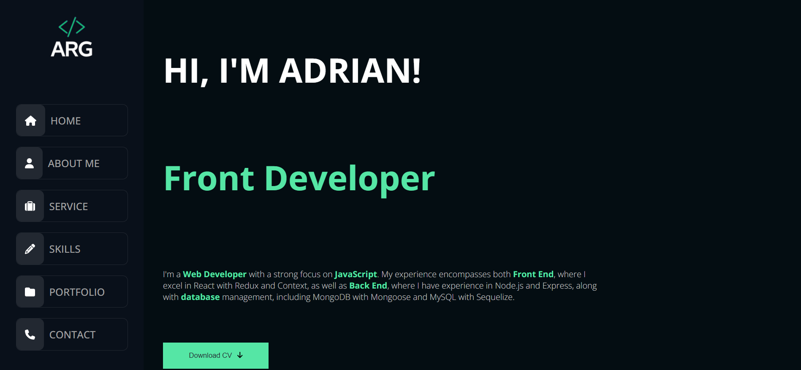

# Fullstack Web Developer Portfolio

Welcome to my Fullstack Web Developer portfolio! Here you'll find a collection of my previous projects reflecting my experience and skills in the world of web development. I'm passionate about creating dynamic and functional web applications, aiming to provide effective and appealing solutions using technologies in both the frontend and backend.

## What will you find here?

- **About Me:** You can take a look at the technologies I'm familiar with, from programming languages to frameworks and libraries. I'm constantly learning and improving my skills to stay updated with the latest tech trends.

- **Services:** I offer Full Stack, Front-end, and Back-end development services, and I'm comfortable in all of them.

- **Featured Projects:** Explore a variety of web projects I've developed, from interactive web applications to informative websites. Each project includes a brief description, screenshots, and links for you to learn more about them.

- **Contact:** If you're interested in collaborating on a project or have any questions, feel free to get in touch with me. I'm always open to new opportunities and exciting challenges.

Thank you for visiting my portfolio. I hope you enjoy exploring my projects and find inspiration for future collaborations. Don't hesitate to reach out to discuss ideas or work together on web projects! Over time I will be adding more content and fixing small bugs that the web may have.

## Preview

## Contact

If you have any questions or suggestions, don't hesitate to contact me:

- Name: Adrián Ramírez
- Email: adrianramirezgalera@gmail.com
- GitHub: [AdrianRgGit](https://github.com/AdrianRgGit)
